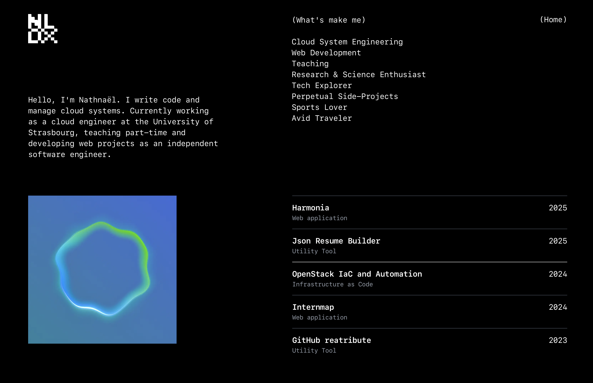

<p align="center">
	
</p>

<p align="center">
	
</p>

# <div align="center">My portfolio</div>
<div align="center">
	<samp>My personal portfolio website, built with Next.js App Router and Tailwind CSS.</samp>
</div>

<hr>

## ℹ️ About
This project is my personal portfolio website, built with Next.js App Router and Tailwind CSS. It showcases only a homepage with some of my projects. But it will be extended in the future with a blog and more detailed project pages.

<p align="center">
	
</p>

## ✨ Features

- **Homepage**: A clean and modern homepage showcasing my projects.
- **Dynamic data fetching**: Projects data is fetched from a local yaml file.

## 🛠️ Getting started

### Installation
```bash
$ pnpm install
```

### Development
```bash
$ pnpm run dev 
#or, with vercel
$ vercel dev
```

### Deployment
```bash
$ vercel --prod
```

Or simply push to the main branch, if you have the vercel integration enabled.

> **Note:** Don't forget to set the environment variables in the vercel dashboard.

## 📝 Future improvements
- Section blog
- Detailed project pages
- Section resume 
- External fetching of yaml data

